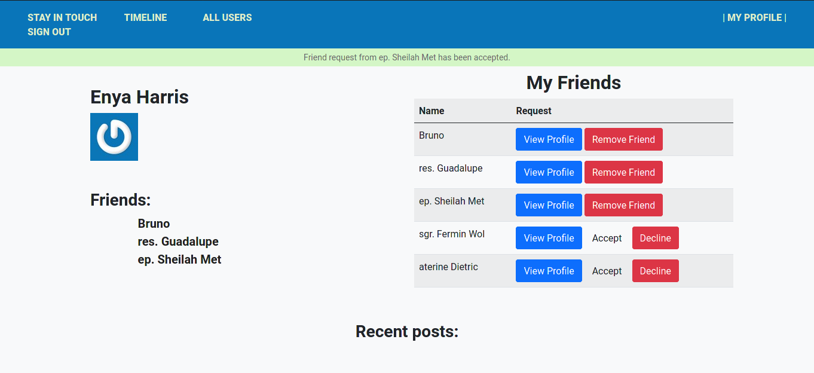

# Scaffold for social media app with Ruby on Rails

> In this project I forked a sample repo of a social media App (with no functionalities) from microverse and I built on top of it a Social Media application. You can sign up with email and password and then create posts, add other user as friends, read the post of your friends, coment and give them a like.



## Built With

- Ruby v2.7.0
- Ruby on Rails v5.2.4


## Getting Started

To get a local copy up and running follow these simple example steps.

### Prerequisites

Ruby: 2.6.3
Rails: 5.2.3
Postgres: >=9.5

### Setup

Instal gems with:

```
bundle install
```

Setup database with:

```
   rails db:create
   rails db:migrate
   rails db:seed
```

### Github Actions

To make sure the linters' checks using Github Actions work properly, you should follow the next steps:

1. On your recently forked repo, enable the GitHub Actions in the Actions tab.
2. Create the `feature/branch` and push.
3. Start working on your milestone as usual.
4. Open a PR from the `feature/branch` when your work is done.


### Usage

Start server with:

```
    rails server
```

Open `http://localhost:3000/` in your browser.

### Run tests

```
    rpsec --format documentation
```

### Deployment

Deployed with Heroku

[Live Link](https://ancient-sierra-54683.herokuapp.com/users/sign_in)

## Author

👤 **Iyunda Ismael Antonio**

- GitHub: [@ixboy](https://github.com/ixboy)
- Twitter: [@ismaelixboy](https://twitter.com/ismaelixboy)
- LinkedIn: [ismael-antonio](https://www.linkedin.com/in/ismaelantonio/)


## 🤝 Contributing

Contributions, issues and feature requests are welcome!

Feel free to check the issues page.

## Show your support

Give a ⭐️ if you like this project!

## Acknowledgments

- 

## 📝 License

- This project is MIT licensed.
